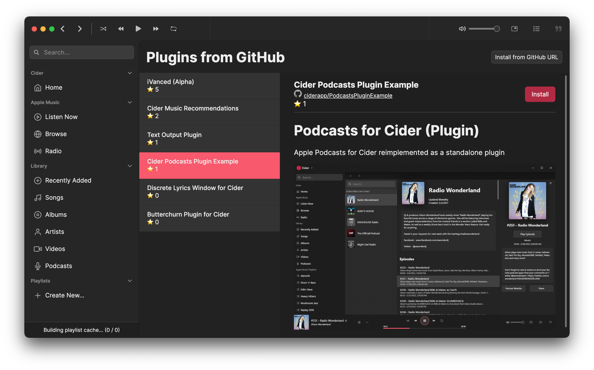

# Publishing to GitHub

Once you have completed your plugin its time to publish! Create a new repository for the plugin and upload the files.

To have the theme indexed into Cider's built in plugin explorer, add `cidermusicplugin` as a topic on the repository.&#x20;

